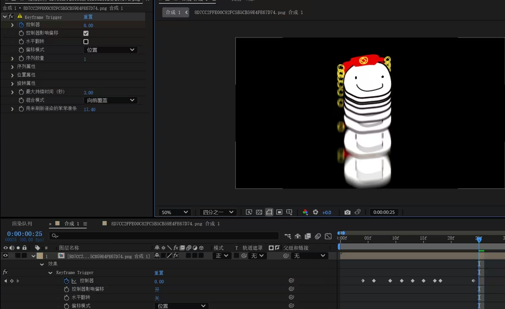
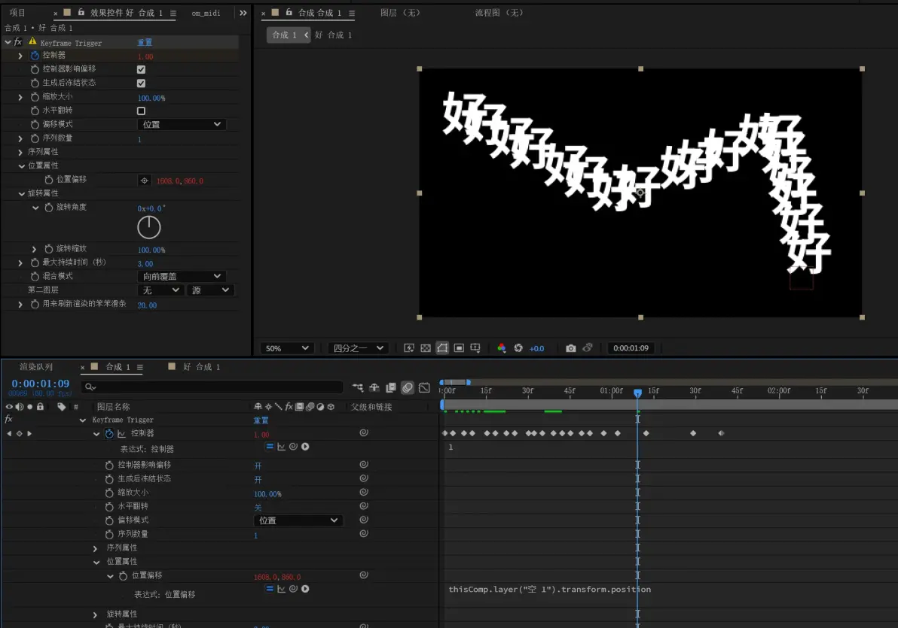

# Keyframe-Trigger
这是一个可以通过关键帧触发，以克隆图层并从开始播放的 After Effects 插件。

This is an After Effects plugin that can be triggered by keyframes to clone layers and play them from the beginning.

您可以为您的使用语言进行该插件的翻译工作！详情请查看存储库中的 [KTrigger_Strings.cpp](KTrigger_Strings.cpp) 文件。

You can contribute to translating this plugin into your language! For details, please refer to the [KTrigger_Strings.cpp](KTrigger_Strings.cpp) file in this repository.

## 示例 Example

## 用法 Usage

你可以查阅下面的文章，最新功能请以最新版本为准。

You can refer to the article below for information. Please note that the latest features are subject to the most recent version.

* [首发专栏](https://www.bilibili.com/opus/1031261835839406084)
* [v1.8 更新 & 使用例](https://www.bilibili.com/opus/1034923669077360658)
* [v2.0 更新 & 使用例](https://www.bilibili.com/opus/1039052240760864803)
* [v2.1 更新 & 使用例](https://www.bilibili.com/opus/1059827757801799682)
* [v2.3 更新 & 使用例](https://www.bilibili.com/opus/1104365177069895705)